# Dynamic Document Translator - Workflow

## 🔄 Translation Process Flow

```mermaid
flowchart TD
    A[📄 User Uploads PDF] --> B[📊 Document Parser Agent]
    B --> |"Extracted Text<br/>+ Formatting Metadata<br/>+ Document Structure"| C[🔍 Language Detection Agent]
    
    C --> |"Source Language: Spanish<br/>Confidence: 95%"| D{👤 User Selection}
    D --> |"User selects:<br/>Target Language"| E[🌐 Translation Agent]
    
    E --> |"Quality Check<br/>Built-in"| F{Translation Quality}
    F --> |"Quality < 80%"| G[🔄 Retry Translation]
    G --> E
    F --> |"Quality ≥ 80%"| H[📋 Output Formatter Agent]
    
    H --> |"Preserves Original<br/>Formatting"| I[✅ Final Translated PDF]
    
    %% Styling
    classDef userInput fill:#e1f5fe,stroke:#0277bd,stroke-width:2px
    classDef agent fill:#f3e5f5,stroke:#7b1fa2,stroke-width:2px
    classDef decision fill:#fff3e0,stroke:#f57c00,stroke-width:2px
    classDef output fill:#e8f5e8,stroke:#388e3c,stroke-width:2px
    
    class A,D userInput
    class B,C,E,H agent
    class F decision
    class I output
    class G agent
```



## 📋 Detailed Agent Specifications

### 1. 📄 Document Parser Agent
**Input:** PDF file (binary buffer)  
**Processing:** 
- Text extraction using Gemini's native PDF processing
- Preserve formatting metadata (fonts, styles, layout)
- Maintain document structure (headings, paragraphs, tables)

**Output:**
```json
{
  "extractedText": "Full document text content...",
  "metadata": {
    "fonts": ["Arial", "Times New Roman"],
    "pageCount": 5,
    "hasImages": true,
    "hasTables": true
  },
  "structure": {
    "headings": [...],
    "paragraphs": [...],
    "formatting": [...]
  }
}
```

### 2. 🔍 Language Detection Agent
**Input:** Extracted text content  
**Processing:** Analyze text to identify source language with confidence scoring

**Output:**
```json
{
  "detectedLanguage": "Spanish",
  "confidence": 0.95,
  "availableTargets": ["English", "French", "German", "Italian"],
  "needsUserSelection": true
}
```

### 3. 🌐 Translation Agent (with Quality Check)
**Input:** Source text + target language selection  
**Processing:** 
- Context-aware translation
- Built-in quality validation
- Automatic retry for low-quality translations

**Output:**
```json
{
  "translatedText": "Translated content with preserved structure...",
  "qualityScore": 0.92,
  "preservedStructure": true,
  "translationMetrics": {
    "accuracy": 0.94,
    "fluency": 0.90
  }
}
```

### 4. 📋 Output Formatter Agent
**Input:** Translated text + original metadata + structure  
**Processing:** PDF reconstruction maintaining original formatting

**Output:** 
- Final translated PDF file with preserved layout
- Translation metadata and logs

## 🎯 Human-in-the-Loop Integration

The user interaction occurs after language detection:

1. **System presents detected language** with confidence score
2. **User selects target language** from available options
3. **System continues** with translation process
4. **Optional:** User can review and approve final output

## 🔧 Technical Implementation

- **Framework:** LangGraph.js for agent orchestration
- **Document Processing:** Vercel AI SDK with Gemini for native PDF handling
- **State Management:** LangGraph's built-in state management
- **UI:** Next.js with React for user interaction
- **Quality Assurance:** Integrated into Translation Agent

## ⚡ Benefits of This Architecture

1. **Reduced Complexity:** 4 agents instead of 5 (removed redundant Quality Checker)
2. **Native PDF Processing:** No external parsing libraries needed
3. **Human Control:** User selects target language for better accuracy
4. **Format Preservation:** Maintains original document styling
5. **Quality Assurance:** Built-in validation and retry logic
6. **Scalable:** Easy to add new languages and document types
